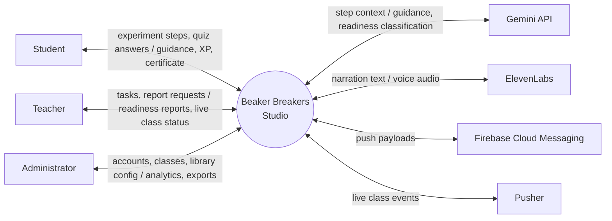

<div align="center">


# Beaker Breakers Studio

### The chemistry lab that fits inside a browser.

**An AI powered, gamified virtual chemistry laboratory with Augmented Reality, built so that no student has to skip a practical because the school has no lab.**

<br/>

[](#-roadmap)
[](#-the-team)
[](#-the-team)
[](#-license)

<br/>

[](https://laravel.com)
[](https://nextjs.org)
[](https://react.dev)
[](https://flutter.dev)
[](https://mysql.com)
[](https://redis.io)
[](https://ai.google.dev)
[](https://developers.google.com/ar)

<br/>

[**Overview**](#-why-this-exists) · [**Features**](#-what-it-does) · [**Architecture**](#-how-it-fits-together) · [**Setup**](#-getting-started) · [**Docs**](#-documentation) · [**Roadmap**](#-roadmap)

</div>

<br/>

---

## 🧪 Why this exists

Chemistry is compulsory at secondary level in Pakistan, and the syllabus assumes students will do practical work. Very often they do not.

We did not start from a market report. We started from our own Class 10 and Class 12 classrooms, where the practical was read out of a book instead of performed. To check whether that experience generalised, we ran an informal validation exercise at the university open house and then a structured online survey.

> **What the survey told us (N = 13, September 2026)**
>
> Every respondent reported having access to a device capable of running the system. Free text answers surfaced a need the closed questions had missed, including one respondent who wrote that students *"are not allowed to do practicals"* at all.
>
> Two findings went against our own assumptions, and we kept them anyway:
> **Augmented Reality ranked 5th** out of the proposed features, and **gamification ranked last**. This is a thirteen person, self selected sample, so it cannot be generalised, but it did change how we prioritised the build.

Six problems came out of the four elicitation sources, and the system is built to answer them:

| # | Problem |
|:--|:--|
| 1 | Students with no access, or only shared and infrequent access, to practical chemistry work |
| 2 | A failed experiment cannot be repeated once the reagents are consumed |
| 3 | No formal verification that a student is safety competent before handling real apparatus |
| 4 | No objective evidence for a teacher to judge readiness for a real laboratory |
| 5 | No way for a student to practise outside timetabled class hours |
| 6 | Inequality in practical science education between well resourced and under resourced schools |

<br/>

## ⚗️ What it does

<table>
<tr>
<td width="33%" valign="top">

### 🛡️ Safety First
Four sequential safety tiers: **Basic Lab Rules**, **Chemical Handling**, **Fire and Heat Safety**, **First Aid and Emergency**.

A tier unlocks only at **80 percent or above**. No experiment opens until Tier 1 is passed. Pass all four and the system issues a **digital safety certificate** carrying a unique identifier and the four tier scores.

</td>
<td width="33%" valign="top">

### 🤖 AI That Guides, Not Grades
Step by step guidance from the **Gemini API**, delivered in the student's flow rather than after the fact, with an **ElevenLabs** avatar voice.

Every score is computed **on the server**. A client submitted score is never accepted.

</td>
<td width="33%" valign="top">

### 📊 Readiness, Not Just Marks
A **six dimension readiness report** gives the teacher objective evidence of whether a student is prepared for a real laboratory.

Live class monitoring, task assignment, broadcasts and exportable class reports.

</td>
</tr>
<tr>
<td valign="top">

### 📱 AR Mode
Surface detection through **ARCore** and **ARKit** places the apparatus on the student's own desk.

</td>
<td valign="top">

### 🎮 Progression
Experience points, badges, daily missions, streaks and class leaderboards, weighted by what the survey actually asked for.

</td>
<td valign="top">

### 🏫 Built for Schools
Role based access for Student, Teacher and Administrator. Bulk student import, class management and a school wide certificate registry.

</td>
</tr>
</table>

> **No self registration by design.** Accounts exist only through administrator action. This is a deliberate requirement (`FR-01.6`), not a missing feature, because the system holds student records.

<br/>

## 🗺️ How it fits together



<div align="center"><sub>Full System Context Diagram, use case diagrams, DFDs, activity and state machine diagrams live in <a href="#-documentation"><code>/docs</code></a>.</sub></div>

<br/>

## 🧱 Tech stack

| Layer | Technology | Purpose |
|:--|:--|:--|
| **Backend** | Laravel 11 (PHP) | REST API and administration panel |
| **Web** | React 18 with Next.js 14 | Web frontend with server side rendering |
| **Mobile** | Flutter 3 with Dart | Cross platform Android and iOS application |
| **Database** | MySQL 8.0 | Primary relational database |
| **Cache** | Redis 7 | Caching, sessions, queues and leaderboards |
| **Runtime** | Node.js 20 LTS | Build tooling and SSR server |
| **AR** | ARCore / ARKit | Surface detection and tracking |
| **AI** | Gemini API | Step guidance and readiness classification |
| **Voice** | ElevenLabs API | Avatar voice synthesis |
| **Storage** | AWS S3 with Cloudflare CDN | Asset storage and delivery |
| **Push** | Firebase Cloud Messaging | Mobile notifications |
| **Email** | SendGrid v3 | Transactional email |
| **Realtime** | Pusher | Live class monitoring events |

<br/>

## 🚀 Getting started

> ⚠️ **Heads up:** the system is under active development. The steps below describe the intended local setup and will be finalised as the modules land. Check [Roadmap](#-roadmap) for what currently runs.

<details>
<summary><b>Prerequisites</b></summary>

<br/>

| Tool | Version |
|:--|:--|
| PHP | 8.2 or later |
| Composer | 2.x |
| Node.js | 20 LTS |
| MySQL | 8.0 or later |
| Redis | 7.x |
| Flutter SDK | 3.x (mobile only) |

</details>

**1. Clone the repository**

```bash
git clone https://github.com/<your-org>/beaker-breakers-studio.git
cd beaker-breakers-studio
```

**2. Backend (Laravel 11)**

```bash
cd backend
composer install
cp .env.example .env
php artisan key:generate

# configure DB_*, REDIS_*, GEMINI_API_KEY, ELEVENLABS_API_KEY,
# SENDGRID_API_KEY, PUSHER_* and AWS_* in .env before continuing

php artisan migrate --seed
php artisan serve
```

**3. Web frontend (Next.js 14)**

```bash
cd ../web
npm install
cp .env.local.example .env.local      # set NEXT_PUBLIC_API_URL
npm run dev                            # http://localhost:3000
```

**4. Mobile app (Flutter 3)**

```bash
cd ../mobile
flutter pub get
flutter run                            # AR Mode needs a physical device
```

> 🔐 **Never commit `.env`.** All API keys stay in environment variables. The repository ships `.env.example` files only.

<br/>

## 📁 Project structure

```
beaker-breakers-studio/
├── backend/            # Laravel 11 REST API, admin panel, server side scoring
│   ├── app/
│   ├── database/
│   └── routes/
├── web/                # Next.js 14 portal (student, teacher, admin dashboards)
│   ├── app/
│   └── components/
├── mobile/             # Flutter 3 app with AR Mode
│   └── lib/
├── docs/               # SRS, design chapter, diagrams, business plan
│   ├── diagrams/       # .mmd sources and rendered PNGs
│   └── assets/
└── README.md
```

<br/>

## 📚 Documentation

| Document | What is inside |
|:--|:--|
| **Software Requirements Specification** | Written to ISO/IEC/IEEE 29148:2018, 22 sections |
| **Chapter 3, Requirement Specifications** | Elicitation method, survey findings, 63 functional, 12 non functional and 10 security requirements |
| **Chapter 4, System Design** | Architecture, database design, interface design, 20 figures |
| **Diagram set** | System context, use case, DFD level 0 and 1, activity, activity with swimlanes, state machine and ER diagrams, as Mermaid sources and PNGs |
| **Business Plan and Feasibility Study** | Market, costing, unit economics and cost benefit analysis |

Every requirement identifier used across the diagrams, the SRS and the design chapter resolves to the same numbering defined in Chapter 3. `FR-01.1` means the same thing everywhere.

<br/>

## 🧭 Roadmap

- [x] Requirement elicitation, survey and analysis
- [x] Chapter 3, Requirement Specifications
- [x] Software Requirements Specification, ISO/IEC/IEEE 29148:2018
- [x] Full diagram set with traceability to requirements
- [x] Chapter 4, System Design
- [ ] Authentication and role based access
- [ ] Safety certification, four tiers
- [ ] Experiment engine and library
- [ ] AI step guidance integration
- [ ] Gamification, leaderboards and missions
- [ ] AI readiness reporting
- [ ] Teacher class management
- [ ] Administration and analytics
- [ ] AR Mode
- [ ] Pilot deployment in a partner school

<br/>

## 👥 The team

| Name | Role |
|:--|:--|
| **Rabail** | Project lead, frontend and documentation |
| **Syed Mohsin Abbas** | Backend |
| *Supervisor* | *to be added* |

**Department of Computer Science, The University of Chenab, Gujrat, Pakistan**
Final Year Project, BSCS

<br/>

## 🤝 Contributing

This is an academic Final Year Project and is not currently open to outside contributions. If you are working in the same problem space, in practical science education for under resourced schools, we would be glad to hear from you.

<br/>

## 📄 License

To be decided before public release.

<br/>

---

<div align="center">

**Every student deserves a lab.**
<sub>Built at The University of Chenab, Gujrat.</sub>

</div>
